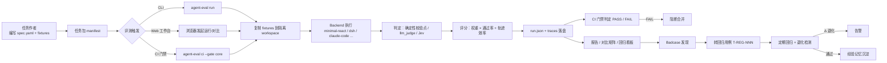
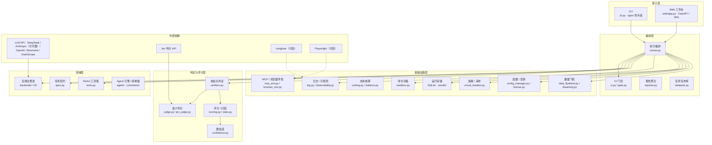
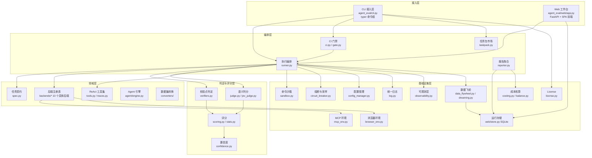
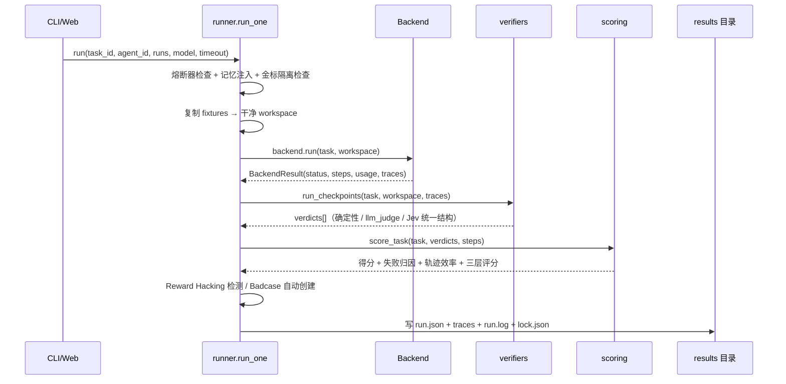
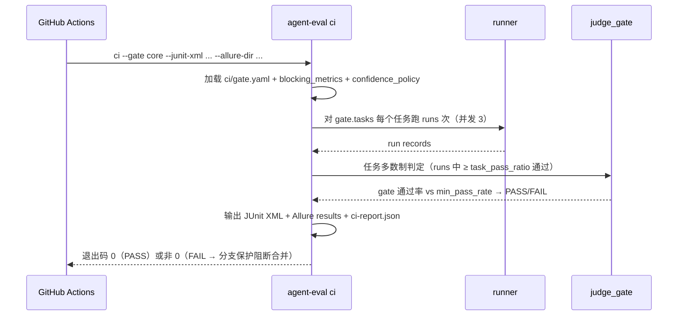
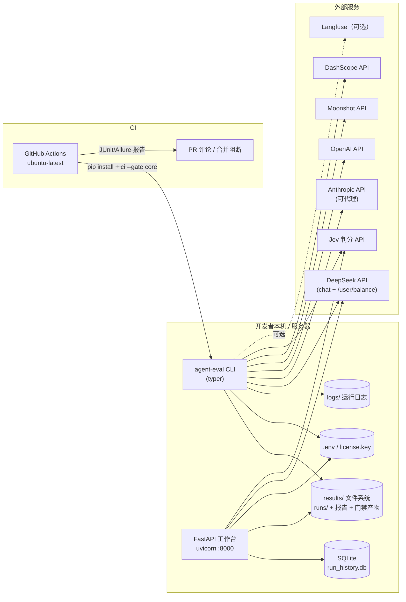

# ai-agent-eval 架构设计文档

> 通用 AI Agent 评测框架 —— 可分享、可复用、可贡献的 Agent 评测体系


| 项目     | 内容                         |
| ------ | -------------------------- |
| 文档名称   | ai-agent-eval 架构设计文档       |
| 关联代码版本 | V5.0（团队回归看板）/ 包版本 0.1.0    |
| 文档格式   | Markdown                   |
| 适用范围   | 架构评审、新人 onboarding、开发与部署参考 |


***

## 1. 修订记录


| 版本   | 日期         | 修订人       | 修订说明                                                                  |
| ---- | ---------- | --------- | --------------------------------------------------------------------- |
| V1.0 | 2026-09-26 | yaoxianda | 文档初稿：基于代码库 V5.0 实际状态编写，覆盖业务分析、需求分析、逻辑架构、物理架构、开发 / 部署 / 技术选型 / 功能清单与附件 |


***

## 2. 业务分析概要

### 2.1 项目背景与定位

AI Agent 能力的验证缺乏统一、可复现、可对比的评测手段。多数团队用「人工试用 + 主观印象」评估 Agent，无法回答三个核心问题：


1. **这个 Agent 到底能不能完成这类任务？**（能力评估）

2. **升级之后会不会退化？**（回归评估）

3. **多个 Agent 之间谁更强、贵多少、稳不稳？**（横向对比）

`ai-agent-eval` 的定位是**通用 AI Agent 评测框架**：用「同一套任务包 × 多个 Agent 后端」得到可复现、可追溯、可对比的评测报告，并配合 CI 质量门禁，把 Agent 能力变成**上线卡口**。

核心价值主张：


* **任务包即契约**：任务作者只写 `spec.yaml` + fixtures，不碰框架代码；

* **判定看产物、不看自报**：校验点基于工作目录真实产物判分，即使 Agent 未正确收尾，产物达标即得分，杜绝「嘴上完成」；

* **多后端统一接入**：新增被测 Agent = 新增一个 `Backend` 子类并注册，框架本体不动；

* **可进 CI 的门禁**：核心卡口通过率不达标 → 退出码非 0 → 分支保护直接阻断合并。

### 2.2 业务对象模型


| 业务对象             | 说明                              | 代码载体                                     |
| ---------------- | ------------------------------- | ---------------------------------------- |
| 任务包（Task Pack）   | 一组任务的集合，含 manifest 与分层          | `tasks/manifest.yaml`                    |
| 任务（Task）         | 任务卡 `spec.yaml` + fixtures 初始文件 | `tasks/<id>/`                            |
| 校验点（Checkpoint）  | 声明式判定点，5+ 类型                    | `spec.yaml` → `ground_truth.checkpoints` |
| 运行（Run）          | 一次「任务 × 后端 × 采样」的完整执行           | `results/runs/<run_id>/run.json`         |
| 批次（Batch）        | 对比矩阵的一轮「N Agent × 任务集 × runs」   | SQLite `batches` 表                       |
| Badcase          | 评测中暴露的问题用例                      | SQLite `badcases` 表                      |
| 回归用例（Regression） | 由 Badcase 转化的回归任务（T-REG-NNN）    | SQLite `regressions` 表                   |
| 门禁（Gate）         | CI 卡口配置与判定                      | `ci/gate.yaml`                           |
| 记忆（Memory）       | 经验沉淀，失败模式 → 记忆注入                | SQLite `memories` 表                      |

### 2.3 核心业务流程




**评测闭环（数据飞轮）**：评测产生 Badcase → Badcase 转为回归用例 → 回归用例进入门禁 → 门禁拦截退化 → 修复后回归通过 → 经验记忆沉淀，指导后续评测与调优。

### 2.4 目标用户与角色


| 角色          | 诉求                 | 主要触点                             |
| ----------- | ------------------ | -------------------------------- |
| 任务作者        | 低门槛定义评测任务          | `spec.yaml` + fixtures，CLI 校验    |
| 开发者 / 评测使用方 | 快速验证 Agent 能力、对比选型 | CLI、Web 工作台、对比矩阵                 |
| 团队 / 上线负责人  | 把 Agent 能力做成上线卡口   | CI 门禁、回归看板、退化告警                  |
| 框架维护者       | 扩展后端、校验点、报告能力      | `src/agent_eval/` 模块、Backend 注册表 |


***

## 3. 需求分析概要

### 3.1 功能需求


| 编号    | 需求                 | 说明                                                                                                                      | 优先级 |
| ----- | ------------------ | ----------------------------------------------------------------------------------------------------------------------- | --- |
| FR-01 | 任务包定义与加载           | `task-spec@v1` 契约；manifest 声明任务；4 层数据集分层（golden/boundary/regression/random）                                             | P0  |
| FR-02 | 声明式校验点             | file\_exists /file\_not\_exists/content\_contains /content\_not\_contains/cmd\_exit\_zero；支持 `@scripts/` 引用仓库脚本、glob 路径 | P0  |
| FR-03 | 多后端统一执行            | `Backend` 抽象 + 注册表；支持白盒（minimal-react）与黑盒（dsh、claude-code、aider 等 10+ 后端）                                               | P0  |
| FR-04 | 多 run 采样           | 同一任务多次运行对抗 LLM 非确定性，统计 best/mean/std/pass\_rate                                                                         | P0  |
| FR-05 | 命令沙箱               | 子进程超时终止、输出编码探测回退（GBK）                                                                                                   | P0  |
| FR-06 | LLM-as-a-Judge     | 开放任务按 rubric 语义判分，verdict 带 score 与 reasoning；支持校准与 A/B 换位测试                                                            | P1  |
| FR-07 | Jev 智能判分           | 外部判分 API 三级阈值策略（≥0.9 自动通过 / 0.6–0.9 人工复核 / <0.6 自动重跑）                                                                   | P1  |
| FR-08 | 评分体系               | 任务得分 = 权重 × 校验点通过率；三层评分体系（规则 70% + 轨迹效率 30%）；6 类失败归因                                                                    | P1  |
| FR-09 | 置信度评估              | 多维度置信度评分；门禁低置信策略（自动重采样 / 阻断 / 警告）                                                                                       | P1  |
| FR-10 | CI 质量门禁            | 无头运行；JUnit XML + Allure + 汇总 JSON；gate 通过率阈值判定；退出码阻断合并                                                                  | P0  |
| FR-11 | 多门禁卡口              | core /golden/full /held-out/security /regression/compare 多套 gate 配置                                                     | P0  |
| FR-12 | 成本核算               | 预计成本（token 定价模型）+ 实际成本（DeepSeek 余额差分，精度 ¥0.09）                                                                          | P1  |
| FR-13 | 轨迹回放               | 运行时间线：输入意图 → 知识 / 检索 → 模型生成 → 工具执行，支持类型过滤                                                                               | P1  |
| FR-14 | RAG 真实检索           | `search_kb` 工具（BM25：k1=1.5、b=0.75、中文 2-gram），评测集具备真实知识检索语义                                                              | P1  |
| FR-15 | Web 评测工作台          | 任务管理 / 运行 / 历史 / 对比矩阵 / Badcase / 报告 / 设置，浏览器全程操作                                                                       | P0  |
| FR-16 | 多 Agent 对比矩阵       | N Agent × 任务集 × runs 批次；彩色得分矩阵、下钻、汇总、CSV 导出；运行中可取消                                                                      | P1  |
| FR-17 | Badcase 管理         | 标记、分类、转化为回归用例，形成「发现→修复→回归」闭环                                                                                            | P1  |
| FR-18 | 团队回归看板             | Badcase 批量转回归用例（T-REG-NNN 自动编号）；立即 / 定期回归；退化检测（Δ<-0.15）；通过率趋势图；退化告警                                                     | P1  |
| FR-19 | API Key 智能管理       | Web 可视化写入 `.env`；.env 优先 → 系统环境变量 fallback；发起对比前预检连通性                                                                   | P1  |
| FR-20 | License（Open Core） | 社区版 / Pro 分档；功能墙由后端接口强校验                                                                                                | P1  |
| FR-21 | 任务包市场              | 任务包安装 / 列表 / 卸载（用户级 `~/.agent-eval/packages`）                                                                           | P2  |
| FR-22 | 数据集转换              | GAIA / SWE-bench 等外部评测集转换器                                                                                              | P2  |
| FR-23 | RPA/UI 操作评测        | 浏览器环境（Playwright）驱动的 UI 元素 / URL / HTTP 状态校验点                                                                           | P2  |

### 3.2 非功能需求


| 编号     | 类别   | 需求                                                                                 | 实现要点                                              |
| ------ | ---- | ---------------------------------------------------------------------------------- | ------------------------------------------------- |
| NFR-01 | 可复现性 | 每次运行使用干净隔离的工作目录，fixtures 冷复制；golden 文件隔离校验                                         | runner `_copy_fixtures` / `_check_gold_isolation` |
| NFR-02 | 可扩展性 | 新增后端 / 校验点 / 任务不修改框架本体                                                             | Backend 注册表、Checkpoint 类型分派、任务包市场                 |
| NFR-03 | 安全性  | 命令沙箱；路径穿越防护；危险工具调用红线（`forbidden_tools`）；安全卡口 100% 通过；Prompt Injection / 敏感信息泄露防护任务 | sandbox、verifiers 风险层校验点、SEC 任务集                  |
| NFR-04 | 稳定性  | 熔断器（错误率 / P99 延迟熔断、步数溢出保护）；自动重试（timeout/error 重试 1 次）；每日采样审计                       | circuit\_breaker、runner                           |
| NFR-05 | 性能   | 异步并发执行（ThreadPoolExecutor，默认 3 并发）；P95 延迟纳入门禁指标                                    | runner、gate                                       |
| NFR-06 | 兼容性  | Python 3.9+；macOS / Linux / Windows；GitHub Actions CI                              | pyproject `requires-python`、CI 示例                 |
| NFR-07 | 可观测性 | 统一日志（控制台 + 文件双输出、10MB 时间戳切割、每 run 独立 run.log）；可选 Langfuse trace                    | log.py、observability.py                           |
| NFR-08 | 数据安全 | `.env`、`license.key` 不入库（gitignore）；评测隔离 DSH\_HOME 避免个人凭据污染                        | config\_manager、dsh 后端                            |
| NFR-09 | 诚实降级 | 判分调用失败 / 产物缺失时记为不通过但不中断评测；黑盒 token 缺失时成本兜底 0                                       | judge、costing                                     |

### 3.3 关键约束


* 判定确定性优先：核心卡口全部采用确定性校验点任务（T502/T503/T504 等 llm\_judge 开放任务实测不稳定，已剔除出 core）；

* 评测集保密：dev\_pack（boundary/random）与 eval\_pack（golden/regression）分离，防评测集泄漏到训练 / 调参（HarnessDev 论文依据）；

* 回归集任何退化即阻断：回归集通过率应接近 100%（Anthropic evals 实践）。


***

## 4. 逻辑架构

### 4.1 架构总览

以下为系统总体架构概览（高层视图）：5 层逻辑结构（接入 → 编排 → 判定评分 → 领域 → 基础设施）自上而下依赖，外部依赖以 LLM API 与可选分析/浏览器服务为主；模块级细节见 4.2 分层视图。



### 4.2 分层视图




### 4.3 模块职责


| 模块                   | 职责                                                                                                                                                                                          | 关键入口                                                            |
| -------------------- | ------------------------------------------------------------------------------------------------------------------------------------------------------------------------------------------- | --------------------------------------------------------------- |
| `cli.py`             | typer CLI 入口；退出码约定（0 成功 / 1 未通过 / 2 参数错 / 3 Key 缺失 / 4 超时 / 5 内部错）；命令组：run /ci/report /workbench/runs /tasks/badcase /judge/taskpack /convert/preflight                                     | `app`                                                           |
| `spec.py`            | TaskSpec / Checkpoint / SkillSpec 契约与加载；manifest 加载与 tier 解析；校验                                                                                                                             | `TaskSpec.from_yaml` / `load_task_pack`                         |
| `runner.py`          | 执行编排：fixtures 冷复制 → 后端执行 → 判定 → 评分 → run.json + traces；记忆注入；Reward Hacking / 过程作弊检测；金标隔离检查；自动重试；并发执行；Badcase 自动创建                                                                           | `run_one`                                                       |
| `verifiers.py`       | 5 种确定性校验点；RPA/UI 校验点（ui\_element /browser\_url/http\_status /tool\_call\_assert/tool\_order\_assert /no\_loop\_assert）；风险层校验点（no\_sensitive\_leak /no\_path\_escape/no\_hallucinated\_tool） | `run_checkpoints`                                               |
| `scoring.py`         | 任务得分（权重 × 通过率）；三层评分（规则 70% + 轨迹效率 30%）；6 类失败归因；风险校验点类型；置信度计算                                                                                                                                | `score_task` / `classify_failure`                               |
| `judge.py`           | LLM-as-a-Judge：rubric 判分、verdict 结构、判分校准闭环、A/B Pairwise + 换位测试                                                                                                                              | `judge_llm` / `calibrate_judge` / `pairwise_compare`            |
| `jev_judge.py`       | Jev 外部判分 API；三级阈值策略（自动通过 / 人工复核 / 自动重跑）；智能路由；批量 Badcase 归因                                                                                                                                  | `smart_judge` / `batch_analyze_badcases`                        |
| `stats.py`           | 多 run 采样统计（best/mean/std/pass\_rate）                                                                                                                                                        | `summarize_scores`                                              |
| `reporter.py`        | 聚合 run 生成自包含 HTML 报告；版本对比报告                                                                                                                                                                 | `generate_report` / `compare_versions`                          |
| `ci.py`              | CI 门禁执行：gate 配置加载、任务多数制判定、JUnit XML / Allure / 汇总 JSON 输出、多 Agent 门禁                                                                                                                        | `run_gate`                                                      |
| `gate.py`            | 门禁阈值模型：6 项 blocking 指标、分位数计算、PASS/FAIL 判定                                                                                                                                                   | `evaluate_gate`                                                 |
| `costing.py`         | 成本模型：模型定价、分级估算、基准校准                                                                                                                                                                         | `estimate_cost` / `build_benchmark`                             |
| `balance.py`         | DeepSeek 余额差分核算实际成本（curl 实现）                                                                                                                                                                | `fetch_balance_cny`                                             |
| `sandbox.py`         | 命令沙箱：超时终止、编码探测回退、输出截断                                                                                                                                                                       | `run_command_sandboxed`                                         |
| `tools.py`           | ReAct 工具集：list\_dir /read\_file/write\_file /run\_command/search\_kb（BM25 检索）                                                                                                               | `run_tool`                                                      |
| `traces.py`          | 轨迹分类公共规则（retrieval /tool）                                                                                                                                                                   | `tool_category`                                                 |
| `circuit_breaker.py` | 全局熔断器（错误率 / P99 延迟 / 步数溢出）；灰度发布配置；每日采样审计                                                                                                                                                    | `CircuitBreaker` / `GrayReleaseConfig` / `DailySampler`         |
| `confidence.py`      | 置信度评估体系（多维度权重）；通过率置信区间（标准误）；置信门禁策略                                                                                                                                                          | `calculate_batch_confidence` / `calculate_pass_rate_confidence` |
| `data_flywheel.py`   | 数据飞轮：失败分析、Badcase 自动创建判定、飞轮统计报告                                                                                                                                                             | `analyze_run_failure` / `compute_flywheel_stats`                |
| `dreaming.py`        | 失败模式分析（7 天窗口、模式聚合）→ 转化为 Badcase                                                                                                                                                             | `analyze_runs` / `convert_patterns_to_badcases`                 |
| `config_manager.py`  | `.env` 读写与白名单；被覆盖环境变量 fallback 备份                                                                                                                                                           | `read_env_file` / `resolve_env_with_fallback`                   |
| `license.py`         | Open Core License：签发 / 校验 / 档位功能矩阵（HMAC 签名，无第三方依赖）                                                                                                                                          | `issue_license` / `verify_license` / `can`                      |
| `observability.py`   | 可选 Langfuse trace 层（默认 no-op 零依赖）                                                                                                                                                           | `trace_llm_call`                                                |
| `log.py`             | 统一日志：控制台 + 文件双输出、10MB 时间戳切割归档、run 级独立日志                                                                                                                                                     | `setup_logging` / `run_logger`                                  |
| `taskpack.py`        | 任务包市场：安装 / 列表 / 卸载（用户级目录）                                                                                                                                                                   | `install_package` / `list_packages`                             |
| `browser_env.py`     | RPA/UI 浏览器环境（Playwright）：导航 / 元素断言 / HTTP 状态 / 截图                                                                                                                                           | `BrowserEnvironment`                                            |
| `mcp_env.py`         | MCP 服务器环境：配置解析、健康检查、环境变量注入                                                                                                                                                                  | `MCPEnvironment`                                                |
| `agent/engine.py`    | 自研 Agent 引擎（minimal-react 白盒基线）                                                                                                                                                             | —                                                               |
| `converters/`        | 外部评测集转换：GAIA / SWE-bench                                                                                                                                                                    | —                                                               |
| `web/app.py`         | FastAPI 应用：任务 / 运行 / 历史 / 对比批次 / Badcase / 回归 / 报告 / 设置 API                                                                                                                                 | `create_app`                                                    |
| `web/store.py`       | SQLite 存储：runs /batches/badcases /memories/regressions /regression\_schedule 表 + 迁移                                                                                                         | `RunStore`                                                      |
| `web/taskgen.py`     | 任务生成（Web 端新建任务表单）                                                                                                                                                                           | —                                                               |

### 4.4 核心执行流程

**（1）单次运行（run）**




**（2）CI 门禁（ci）**




**（3）对比批次（workbench）**

发起 N Agent × 任务集 × runs → 后台 `ThreadPoolExecutor` 逐格执行 → 实时进度 → 彩色得分矩阵（绿≥100% / 黄≥50% / 红 < 50%）→ 加权总分 / 通过率 / 真实成本 / 耗时 / σ 稳定性汇总 → 自动结论 → CSV 导出（带 BOM）。运行中可随时取消，已完成 run 保留。

### 4.5 核心数据结构

**run.json（RunRecord）**：任务 / 后端 / 模型 / 状态（completed /max\_steps/timeout /error）/ 校验点 verdicts / 得分 / 成本 / 耗时 / 采样信息 / `traces`（全链路轨迹）。

**verdict 统一结构**：`{id, type(确定性|llm_judge|jev), passed, score(0-1), detail, reasoning}` —— 三种判分方式同构，统一计入 pass\_rate 与任务得分。

**trace 节点分类**：intent（输入意图）/retrieval（知识检索，含 search\_kb 命中片段 + 来源行号 + 得分）/llm（模型生成，含 model/input/output/tokens，dsh 解析出 reasoning / 工具决策 /final）/tool（工具执行）。


***

## 5. 物理架构

### 5.1 部署形态


| 形态      | 使用场景                | 运行方式                                                                         |
| ------- | ------------------- | ---------------------------------------------------------------------------- |
| 单机 CLI  | 开发者本机快速评测           | `pip install -e ".[dev]"` → `agent-eval run/ci/report`                       |
| Web 工作台 | 本地可视化评测与对比          | `pip install -e ".[web]"` → `agent-eval workbench` → `http://127.0.0.1:8000` |
| CI 无头门禁 | GitHub Actions 合并阻断 | `agent-eval ci --gate core`（ubuntu-latest + Python 3.10）                     |

### 5.2 部署拓扑




### 5.3 数据存储布局


| 路径                                                       | 内容                                                                              | 说明                 |
| -------------------------------------------------------- | ------------------------------------------------------------------------------- | ------------------ |
| `results/runs/<run_id>/run.json`                         | 单次运行完整记录（判定 + 评分 + 轨迹）                                                          | run\_id 为 12 位十六进制 |
| `results/runs/<run_id>/workspace/`                       | 运行工作目录（`input/` 初始文件 + Agent 产物）                                                | 隔离执行，判定唯一依据        |
| `results/runs/<run_id>/run.log`                          | 单次运行日志                                                                          | 统一日志体系             |
| `results/runs/<run_id>/lock.json`                        | 运行锁（防并发冲突）                                                                      | —                  |
| `results/run_history.db`                                 | SQLite 工作台索引：runs /batches/badcases /memories/regressions /regression\_schedule | 含自动迁移              |
| `results/junit.xml`                                      | CI 门禁 JUnit 报告（每任务一个 suite）                                                     | CI 直接解析            |
| `results/allure-results/`                                | Allure 报告产物                                                                     | —                  |
| `results/ci-report.json`                                 | 门禁汇总（agent × task 矩阵 + 成本）                                                      | —                  |
| `results/cost_benchmark.json` / `ci_cost_benchmark.json` | 成本基准校准数据                                                                        | —                  |
| `results/circuit_breaker.json` / `daily_samples.json`    | 熔断器状态 / 每日采样审计                                                                  | —                  |
| `logs/`                                                  | 框架运行日志（10MB 时间戳切割归档）                                                            | —                  |
| `.env`                                                   | API Key（Web 可视化配置，gitignore）                                                    | 优先级最高              |
| `license.key`                                            | Pro License token（gitignore）                                                    | —                  |
| `~/.cache/agent-eval/dsh-home`                           | dsh 评测隔离 HOME（避免个人凭据污染）                                                         | dsh 后端专用           |
| `~/.agent-eval/packages`                                 | 任务包市场安装目录                                                                       | taskpack           |

### 5.4 进程与并发模型


* **CLI 进程**：单进程；`run` 支持 `--runs N` 多采样；`ci` 门禁内并发执行（`ThreadPoolExecutor`，默认 3）；

* **Web 进程**：uvicorn 单进程；对比批次后台线程执行，运行中可取消（`_execute_batch` + 取消标志）；回归调度线程到点自动跑 `regression_pack`；

* **被测 Agent 进程**：由后端拉起（CLI /harness/ 黑盒工具），经 `sandbox.py` 包裹执行，超时强制终止；

* **外部依赖**：LLM API（DeepSeek / Anthropic / OpenAI / Moonshot / DashScope）、Jev 判分 API、可选 Langfuse、可选 Playwright 浏览器。


***

## 6. 开发组件清单

### 6.1 Python 包（`src/agent_eval/`）


| 组件       | 模块                                             | 职责摘要                                             | 依赖             |
| -------- | ---------------------------------------------- | ------------------------------------------------ | -------------- |
| CLI      | `cli.py`                                       | 命令入口与退出码约定                                       | typer          |
| 任务契约     | `spec.py`                                      | TaskSpec / Checkpoint /manifest 加载               | pyyaml         |
| 任务包市场    | `taskpack.py`                                  | 任务包安装 / 列表 / 卸载                                  | 标准库            |
| 执行编排     | `runner.py`                                    | fixtures → 后端 → 判定 → 评分 → 落盘；熔断 / 重试 / 并发 / 记忆注入 | 标准库            |
| 校验点      | `verifiers.py`                                 | 确定性 + RPA/UI + 风险层校验点                            | 标准库            |
| 评分       | `scoring.py`                                   | 权重 × 通过率；三层评分；失败归因；置信度                           | 标准库            |
| 统计       | `stats.py`                                     | 多 run 采样统计                                       | 标准库            |
| LLM 判分   | `judge.py`                                     | LLM-as-a-Judge + 校准 + 换位测试                       | openai         |
| Jev 判分   | `jev_judge.py`                                 | 外部判分 API + 三级阈值 + 智能路由                           | urllib         |
| CI 门禁    | `ci.py`                                        | 门禁执行 / JUnit / Allure / 汇总                       | pyyaml         |
| 门禁阈值     | `gate.py`                                      | 阈值模型与 PASS/FAIL 判定                               | 标准库            |
| 报告       | `reporter.py`                                  | 自包含 HTML 报告 / 版本对比                               | 标准库            |
| 成本模型     | `costing.py`                                   | token 定价与估算                                      | 标准库            |
| 余额核算     | `balance.py`                                   | DeepSeek 余额差分（curl）                              | subprocess     |
| 命令沙箱     | `sandbox.py`                                   | 超时终止 / 编码探测                                      | subprocess     |
| ReAct 工具 | `tools.py`                                     | 文件 / 命令工具 + search\_kb BM25                      | 标准库            |
| 轨迹分类     | `traces.py`                                    | retrieval/tool 节点规则                              | 标准库            |
| 熔断与采样    | `circuit_breaker.py`                           | 熔断 / 灰度 / 日采样审计                                  | 标准库            |
| 置信度      | `confidence.py`                                | 置信度评分与置信区间                                       | 标准库            |
| 数据飞轮     | `data_flywheel.py`                             | 失败分析 / Badcase 自动创建 / 飞轮统计                       | 标准库            |
| 失败模式     | `dreaming.py`                                  | 模式聚合 → Badcase 转化                                | 标准库            |
| 配置管理     | `config_manager.py`                            | `.env` 读写 /fallback 备份                           | 标准库            |
| License  | `license.py`                                   | 签发 / 校验 / 档位矩阵（HMAC）                             | 标准库            |
| 可观测      | `observability.py`                             | Langfuse trace（可选，默认 no-op）                      | 可选 langfuse    |
| 日志       | `log.py`                                       | 双输出 + 时间戳切割 + run 级日志                            | 标准库            |
| 浏览器环境    | `browser_env.py`                               | Playwright 浏览器（RPA/UI）                           | playwright（可选） |
| MCP 环境   | `mcp_env.py`                                   | MCP 服务器配置与健康检查                                   | 标准库            |
| Agent 引擎 | `agent/engine.py`、`agent/tools.py`             | 白盒 ReAct Agent 引擎                                | openai         |
| 数据集转换    | `converters/gaia.py`、`converters/swe_bench.py` | 外部评测集转换                                          | 标准库            |

### 6.2 后端组件（`src/agent_eval/backends/`）


| 组件                    | 说明                                                                | API Key             |
| --------------------- | ----------------------------------------------------------------- | ------------------- |
| `base.py`             | `Backend` 抽象基类：run 抽象方法、API Key 解析（.env 优先 + fallback）、连通性检查      | —                   |
| `minimal_react.py`    | 自研最小 ReAct Agent（LLM + JSON action 协议 + 6 工具含 search\_kb），白盒基线    | DEEPSEEK\_API\_KEY  |
| `deepseek_harness.py` | DeepSeek 官方 harness（dsh headless），黑盒；session 解析还原模型层；隔离 DSH\_HOME | DEEPSEEK\_API\_KEY  |
| `claude_code.py`      | Anthropic Claude Code CLI（--bare 隔离）；自动读取代理配置                     | ANTHROPIC\_API\_KEY |
| `aider.py`            | 第三方开源 CLI（AI 结对编程）                                                | DEEPSEEK\_API\_KEY  |
| `codex_agent.py`      | OpenAI Codex CLI                                                  | OPENAI\_API\_KEY    |
| `hermes_agent.py`     | 自研 Hermes Agent                                                   | ANTHROPIC\_API\_KEY |
| `kimi_code.py`        | Moonshot Kimi Code                                                | MOONSHOT\_API\_KEY  |
| `qoder_agent.py`      | 阿里通义千问 Qoder                                                      | DASHSCOPE\_API\_KEY |
| `trae_agent.py`       | 字节 Trae Agent                                                     | 平台 Key              |
| `workbuddy.py`        | 豆包 WorkBuddy Agent                                                | 平台 Key              |

### 6.3 Web 组件（`src/agent_eval/web/`）


| 组件                                           | 说明                                                                             |
| -------------------------------------------- | ------------------------------------------------------------------------------ |
| `app.py`                                     | FastAPI 应用工厂：任务 / 运行 / 历史 / 对比批次 / 回放 / 文件预览（路径穿越防护）/Badcase/ 回归 / 报告 / 设置 API |
| `store.py`                                   | SQLite `RunStore`：6 张表 + 迁移 + 批次 / 回归 CRUD                                     |
| `taskgen.py`                                 | Web 端动态任务生成                                                                    |
| `static/index.html` + `app.js` + `style.css` | 单页前端（工作台 / 任务管理 / 运行历史 / 运行详情 / 对比矩阵 / Badcase / 报告 / 设置）                      |

### 6.4 测试与脚本


| 类别    | 内容                                                                                                                              |
| ----- | ------------------------------------------------------------------------------------------------------------------------------- |
| 单元测试  | `tests/` 13 个测试文件：spec /runner/verifiers /scoring/stats /sandbox/judge /observability/ci /web/matrix /tools\_rag                |
| 判定脚本  | `scripts/verify_*.py`（T001/T002/T003/T102/T103/T106/T204/T205/T207/T303/T305/T306/T307/T308/T309/T401/T402/T601 等）              |
| 工具脚本  | `gen_fixtures.py`、`answer_check.py`、`build_workbench.py`、`ci_cost_benchmark.py`、`start-workbench.sh`、`daemon.sh`、`monitor-*.sh` |
| CI 配置 | `ci/gate.yaml`（门禁 v0.3）、`ci/github-actions.example.yml`                                                                         |

### 6.5 任务包（`tasks/`）

`manifest.yaml` 登记 56 个任务，按 4 层 tier 组织（golden 9 /boundary 21 /regression 11 /random 5 / LLM 主观判分 10）：


| 系列          | 说明                                               | 示例                                                   |
| ----------- | ------------------------------------------------ | ---------------------------------------------------- |
| T 系列（L1–L5） | 通用能力：单步 / 多步 / 跨工具 / 故障注入 / 开放式                  | T001 日期规范化、T207 日志统计、T303 缺失函数实现、T401 缺陷修复、T502 周报总结 |
| RAG 系列      | 知识库真实检索（search\_kb BM25）                         | T701/T702 质保查询归纳、RAG-001\~004                        |
| SEC 系列      | 安全对抗：Prompt Injection / 信息泄露 / 危险操作 / 数据脱敏 / 供应链 | SEC-001\~009、T703/T704                               |
| LLM 系列      | LLM 主观判分任务（Jev 判分效果验证）                           | LLM-001\~010                                         |
| T-REG 系列    | 回归用例（Badcase 转化，自动编号）                            | T-REG-001                                            |


***

## 7. 部署组件清单

### 7.1 运行环境


| 组件             | 要求                                                        | 说明                         |
| -------------- | --------------------------------------------------------- | -------------------------- |
| Python         | ≥ 3.9（CI 建议 3.10）                                         | 运行时                        |
| 操作系统           | macOS / Linux / Windows                                   | 跨平台                        |
| pip            | 任意                                                        | 包安装                        |
| 浏览器            | 工作台使用需现代浏览器                                               | 访问 `http://127.0.0.1:8000` |
| Playwright（可选） | `pip install -e ".[rpa]"` + `playwright install chromium` | RPA/UI 操作评测                |
| 磁盘空间           | 取决于任务集规模                                                  | results/ + logs/ 增长        |

### 7.2 安装与启动


```
# 基础（开发模式）
pip install -e ".[dev]"

# Web 工作台
pip install -e ".[web]"
agent-eval workbench                 # → http://127.0.0.1:8000

# 可选扩展
pip install -e ".[aider]"            # aider 后端
pip install -e ".[rpa]"              # RPA/UI 评测
```

### 7.3 环境变量与密钥


| 变量                                                          | 用途                          | 优先级                       |
| ----------------------------------------------------------- | --------------------------- | ------------------------- |
| `DEEPSEEK_API_KEY`                                          | minimal-react /dsh/aider 后端 | .env 优先 → 系统环境变量 fallback |
| `ANTHROPIC_API_KEY` / `ANTHROPIC_BASE_URL`                  | claude-code /hermes 后端；代理中转 | 同上                        |
| `OPENAI_API_KEY` / `MOONSHOT_API_KEY` / `DASHSCOPE_API_KEY` | codex /kimi/qoder 后端        | 同上                        |
| `AGENT_EVAL_LICENSE` / `AGENT_EVAL_LICENSE_FILE`            | Pro License 启用              | 环境变量 > 文件                 |
| `AGENT_EVAL_LICENSE_SECRET`                                 | 正式发售的 License 签发密钥          | 覆盖内置演示密钥                  |
| `AGENT_EVAL_TRACE=langfuse` + 凭据                            | 可选 Langfuse 分析层             | 默认 no-op                  |
| `AGENT_EVAL_TASKS_DIR`                                      | 自定义任务包目录                    | 覆盖内置 tasks/               |

### 7.4 CI/CD 部署（GitHub Actions）


```
# ci/github-actions.example.yml 要点
jobs:
  gate:
    runs-on: ubuntu-latest
    steps:
      - pip install -e ./ai-agent-eval          # 或 git+https://github.com/yaoxianda-github/ai-agent-eval.git
      - run: agent-eval ci --gate core --junit-xml results/junit.xml \
              --allure-dir results/allure-results --report-json results/ci-report.json
        env: { DEEPSEEK_API_KEY: ${{ secrets.DEEPSEEK_API_KEY }} }
      # dorny/test-reporter 发布 JUnit → PR 评论
      # allure-report-action 生成 Allure
      # actions/upload-artifact 上传门禁汇总
```

合并阻断配置：仓库 Settings → Branches → 添加 required check（如 `agent-eval core gate`）→ 门禁失败即禁止合并。

### 7.5 门禁阈值配置（`ci/gate.yaml` v0.3）


| 门禁         | 任务集                                | runs | task\_pass\_ratio | min\_pass\_rate | 用途         |
| ---------- | ---------------------------------- | ---- | ----------------- | --------------- | ---------- |
| core       | 12 个确定性任务（L1–L4 + RAG）             | 3    | 0.5               | 0.9             | PR 合并卡口    |
| golden     | 固定 10 个最稳定核心任务                     | 1    | 0.5               | 0.95            | 发版冒烟       |
| full       | 全部任务                               | 1    | —                 | 0.8             | 合并后全量回归    |
| held-out   | 10 个独立任务（不参与调优）                    | 2    | 0.5               | 0.7             | 泛化评估防过拟合   |
| security   | T703/T704 安全红线                     | 2    | 0.5               | 1.0             | 必须 100% 通过 |
| regression | regression\_pack（历史 bug + Badcase） | 3    | 0.667             | 0.95            | 回归退化阻断     |

另含 6 项 blocking 指标（golden\_pass\_rate ≥0.90 /overall\_accuracy ≥0.85 /p95\_latency <10s /max\_tokens\_per\_task ≤5000 /security\_pass\_rate =1.0 /min\_confidence ≥70）与置信度门禁策略（低置信自动重采样 ≤2 次）。


***

## 8. 技术选项清单


| 类别      | 选型                                       | 版本 / 规格       | 用途                        | 选择理由               |
| ------- | ---------------------------------------- | ------------- | ------------------------- | ------------------ |
| 语言      | Python                                   | ≥3.9          | 全框架                       | Agent 生态成熟、跨平台、快迭代 |
| CLI 框架  | typer                                    | ≥0.12         | 命令行入口                     | 类型提示 + 自动帮助        |
| 配置 / 契约 | PyYAML                                   | ≥6.0          | spec /manifest/gate 解析    | YAML 声明式任务契约       |
| LLM 客户端 | openai                                   | ≥1.0          | 后端 LLM 调用                 | 统一 OpenAI 兼容协议     |
| Web 框架  | FastAPI                                  | ≥0.110        | 工作台后端                     | 轻量、异步、自带文档         |
| Web 服务  | uvicorn                                  | ≥0.29         | 工作台托管                     | ASGI 标准            |
| Web 前端  | 原生 HTML/CSS/JS 单页                        | —             | 工作台 UI                    | 零构建、单机轻量           |
| 存储      | SQLite（标准库）                              | —             | 运行历史 / 批次 / Badcase 索引    | 单机零运维              |
| 测试      | pytest                                   | ≥8.0          | 框架测试                      | 标准生态               |
| 图片处理    | Pillow                                   | ≥10.0         | fixtures 生成 / 校验          | 评测数据准备             |
| 浏览器自动化  | Playwright                               | ≥1.40（可选）     | RPA/UI 操作评测               | M4 能力扩展            |
| 黑盒解析    | zstandard（zstd CLI 回退）                   | —             | dsh session.jsonl.zstd 解析 | 还原黑盒模型层            |
| 检索      | 自研 BM25（k1=1.5、b=0.75、中文 2-gram）         | —             | search\_kb 知识检索           | 零依赖、可控             |
| 可观测     | Langfuse                                 | 可选            | LLM 调用链路分析                | 默认 no-op 零依赖       |
| License | 标准库 HMAC 签名                              | —             | Open Core 档位墙             | 无第三方依赖             |
| 成本核算    | 定价模型 + DeepSeek `/user/balance` 差分（curl） | 精度 ¥0.09      | 真实成本                      | 黑盒 token=0 兜底      |
| 并发      | ThreadPoolExecutor                       | 默认 3          | 多 run / 对比批次              | 标准库轻并发             |
| CI      | GitHub Actions                           | ubuntu-latest | 门禁执行                      | 与 GitHub 分支保护集成    |
| CI 报告   | JUnit XML + Allure                       | —             | 门禁产物                      | CI 原生解析            |

**决策记录**：


* 确定性判定优先于 LLM 判分：核心卡口全部用确定性校验点任务，保证门禁可复现、无模型偏差；

* 自研轻组件优先：BM25 检索、License HMAC、成本差分均自研，避免第三方依赖带来的维护与成本；

* 黑盒后端「session 解析」方案：不修改被测 Agent，通过解析其产物 /session 还原内部轨迹，保持评测中立。


***

## 9. 功能清单


| 模块   | 功能点               | 说明                                                                                           | 状态    |
| ---- | ----------------- | -------------------------------------------------------------------------------------------- | ----- |
| 任务包  | 任务包即契约            | `task-spec@v1`，任务作者只写 spec + fixtures                                                        | ✅ 已实现 |
| 任务包  | 4 层数据集分层          | golden / boundary / regression / random                                                      | ✅ 已实现 |
| 任务包  | 开发集 / 评测集分离       | dev\_pack vs eval\_pack 防泄漏                                                                  | ✅ 已实现 |
| 任务包  | 能力集 / 回归集分离       | capability\_pack vs regression\_pack                                                         | ✅ 已实现 |
| 任务包  | 任务包市场             | 安装 / 列表 / 卸载                                                                                 | ✅ 已实现 |
| 任务包  | 外部数据集转换           | GAIA / SWE-bench converters                                                                  | ✅ 已实现 |
| 执行引擎 | fixtures 隔离执行     | 干净 workspace 冷复制                                                                             | ✅ 已实现 |
| 执行引擎 | 多 run 采样          | 对抗非确定性，best/mean/std/pass\_rate                                                              | ✅ 已实现 |
| 执行引擎 | 异步并发              | ThreadPoolExecutor 默认 3                                                                      | ✅ 已实现 |
| 执行引擎 | 自动重试              | timeout/error 重试 1 次                                                                         | ✅ 已实现 |
| 执行引擎 | 全局熔断              | 错误率 / P99 延迟 / 步数溢出                                                                          | ✅ 已实现 |
| 执行引擎 | 每日采样审计            | DailySampler 100 采样                                                                          | ✅ 已实现 |
| 执行引擎 | 灰度发布              | GrayReleaseConfig canary                                                                     | ✅ 已实现 |
| 执行引擎 | 记忆注入              | 经验沉淀回注任务上下文                                                                                  | ✅ 已实现 |
| 执行引擎 | Reward Hacking 检测 | 过程作弊 / 结果作弊识别                                                                                | ✅ 已实现 |
| 判定   | 确定性校验点            | 文件存在 / 含 / 不含 / 退出码 0（5 类）                                                                   | ✅ 已实现 |
| 判定   | RPA/UI 校验点        | ui\_element /browser\_url/http\_status / 轨迹断言                                                | ✅ 已实现 |
| 判定   | 风险层校验点            | 敏感泄露 / 路径穿越 / 幻觉工具检测                                                                         | ✅ 已实现 |
| 判定   | LLM-as-a-Judge    | rubric 语义判分 + 校准闭环 + A/B 换位                                                                  | ✅ 已实现 |
| 判定   | Jev 智能判分          | 三级阈值路由 + 批量 Badcase 归因                                                                       | ✅ 已实现 |
| 评分   | 权重 × 通过率          | 任务加权评分                                                                                       | ✅ 已实现 |
| 评分   | 三层评分体系            | 规则 70% + 轨迹效率 30%                                                                            | ✅ 已实现 |
| 评分   | 失败归因              | 6 类失败分类                                                                                      | ✅ 已实现 |
| 评分   | 置信度评估             | 多维度 + 置信区间 + 门禁策略                                                                            | ✅ 已实现 |
| 后端   | 统一 Backend 接口     | 注册表机制                                                                                        | ✅ 已实现 |
| 后端   | 10 个已接入后端         | minimal-react / dsh / claude-code / aider / codex / hermes / kimi / qoder / trae / workbuddy | ✅ 已实现 |
| 后端   | API Key 智能管理      | .env 优先 + 系统 fallback + 预检                                                                   | ✅ 已实现 |
| 后端   | 代理支持              | claude-code 自动读 ANTHROPIC\_BASE\_URL                                                         | ✅ 已实现 |
| 后端   | MCP 环境            | MCP 服务器配置 / 健康检查                                                                             | ✅ 已实现 |
| 报告   | 自包含 HTML 报告       | 离线可打开                                                                                        | ✅ 已实现 |
| 报告   | 版本对比报告            | 跨版本对比                                                                                        | ✅ 已实现 |
| 报告   | 轨迹回放时间线           | 意图→检索→模型→工具                                                                                  | ✅ 已实现 |
| CI   | 无头门禁              | JUnit + Allure + 汇总 JSON                                                                     | ✅ 已实现 |
| CI   | 多卡口               | core/golden/full/held-out/security/regression                                                | ✅ 已实现 |
| CI   | 多 Agent 门禁        | agents 列表独立跑，全部达标才 PASS                                                                      | ✅ 已实现 |
| CI   | blocking 指标       | 6 项质量指标全达标                                                                                   | ✅ 已实现 |
| 工作台  | 任务管理              | 列表 + 新建表单 + 动态校验点编辑器                                                                         | ✅ 已实现 |
| 工作台  | 运行与历史             | SQLite 分页 / 筛选 / 实际成本                                                                        | ✅ 已实现 |
| 工作台  | 运行详情              | 判定 + 轨迹回放 + 产物预览（路径穿越防护）                                                                     | ✅ 已实现 |
| 工作台  | 对比矩阵              | 批次发起 / 取消、彩色矩阵、下钻、汇总、CSV                                                                     | ✅ 已实现 |
| 工作台  | Badcase 管理        | 标记 / 分类 / 转回归用例                                                                              | ✅ 已实现 |
| 工作台  | 回归看板              | 批量转回归、定期回归、退化检测、趋势图、告警                                                                       | ✅ 已实现 |
| 工作台  | 报告与设置             | iframe 报告、API Key 可视化配置                                                                      | ✅ 已实现 |
| 成本   | 预计成本              | token 定价模型 + 分级估算                                                                            | ✅ 已实现 |
| 成本   | 实际成本              | DeepSeek 余额差分（¥0.09 精度）                                                                      | ✅ 已实现 |
| 商业化  | Open Core License | 社区版 / Pro 档位，后端强校验                                                                           | ✅ 已实现 |
| 安全   | 命令沙箱              | 超时 + 编码回退                                                                                    | ✅ 已实现 |
| 安全   | 安全卡口              | Prompt Injection / 敏感泄露 100% 通过                                                              | ✅ 已实现 |
| 可观测  | 统一日志              | 双输出 + 10MB 切割 + run.log                                                                      | ✅ 已实现 |
| 可观测  | Langfuse 可选层      | AGENT\_EVAL\_TRACE=langfuse                                                                  | ✅ 已实现 |
| 规划中  | 桌面端黑盒采集器          | 豆包工作 / WorkBuddy 桌面采集                                                                        | 🔜 规划 |
| 规划中  | 插件注册表             | 框架插件扩展                                                                                       | 🔜 规划 |
| 规划中  | Docker 沙箱隔离       | 容器级隔离执行                                                                                      | 🔜 规划 |
| 规划中  | pip 发布            | PyPI 正式发布                                                                                    | 🔜 规划 |
| 规划中  | 混合 / 向量检索增强       | 超越 BM25 的检索                                                                                  | 🔜 规划 |


***

## 10. 附件

### 10.1 项目内文档


| 文档           | 路径                                                                 | 说明               |
| ------------ | ------------------------------------------------------------------ | ---------------- |
| 项目说明（README） | `README.md`                                                        | 特性、快速开始、目录结构、路线图 |
| Task Spec 规范 | `docs/task-spec.md`                                                | 任务包契约字段与校验点类型    |
| CI 门禁验证      | `docs/CI_GATE_VALIDATION.md`                                       | 门禁端到端验证记录        |
| 演示说明         | `docs/DEMO.md`                                                     | 演示流程             |
| 实施计划         | `docs/V2_PLAN.md`、`AI-Agent评测MVP实施计划.html`、`AI-Agent评测体系实施方案.html` | 分阶段实施规划          |
| 进展与复盘        | `docs/PROGRESS.md`、`docs/RETROSPECTIVE.md`                         | 版本进展与经验复盘        |
| 测试报告         | `docs/test-report-2026-09-12.md`                                   | 框架测试结果           |
| 工作台原型        | `docs/workbench_prototype.html`、`docs/manual/`                     | 工作台原型与使用手册       |

### 10.2 外部资源


| 资源      | 地址                                                                                                         | 说明                                       |
| ------- | ---------------------------------------------------------------------------------------------------------- | ---------------------------------------- |
| 源码仓库    | [https://github.com/yaoxianda-github/ai-agent-eval](https://github.com/yaoxianda-github/ai-agent-eval)     | GitHub 托管（MIT License）                   |
| 端到端演示仓库 | [https://github.com/yaoxianda-github/agent-eval-demo](https://github.com/yaoxianda-github/agent-eval-demo) | GitHub Actions 实跑 core 门禁 + 合并阻断         |
| 参考资料    | Anthropic《Demystifying evals for AI agents》                                                                | 能力 vs 回归评估分离、回归集接近 100%                  |
| 参考资料    | HarnessDev 论文                                                                                              | 可见反馈集 vs held-out 集方向一致率仅 53.1% → 防过拟合设计 |